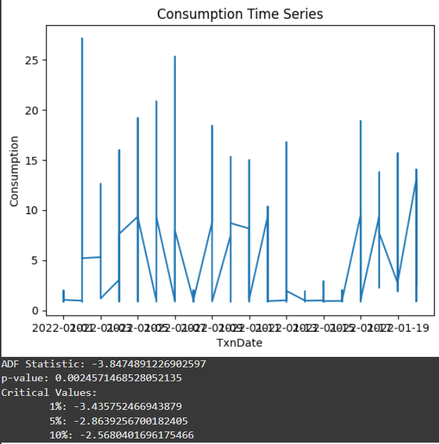
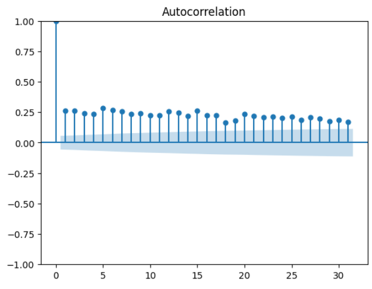
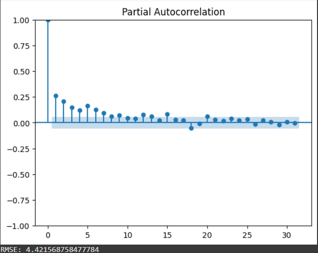
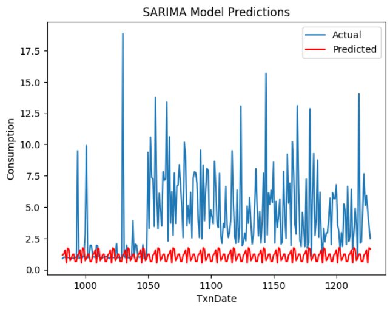

# Exp.no: 10   IMPLEMENTATION OF SARIMA MODEL
### Date: 
### Developed by: Shaik Shoaib Nawaz
### Register number: 212222240094

### AIM:
To implement SARIMA model using python.
### ALGORITHM:
1. Explore the dataset
2. Check for stationarity of time series
3. Determine SARIMA models parameters p, q
4. Fit the SARIMA model
5. Make time series predictions and Auto-fit the SARIMA model
6. Evaluate model predictions
### PROGRAM:
```
import pandas as pd
import numpy as np
import matplotlib.pyplot as plt
from statsmodels.tsa.stattools import adfuller
from statsmodels.graphics.tsaplots import plot_acf, plot_pacf
from statsmodels.tsa.statespace.sarimax import SARIMAX
from sklearn.metrics import mean_squared_error

data = pd.read_csv('/content/KwhConsumptionBlower78_1.csv')
data['TxnDate'] = pd.to_datetime(data['TxnDate'])

plt.plot(data['TxnDate'], data['Consumption'])
plt.xlabel('TxnDate')
plt.ylabel('Consumption')
plt.title('Consumption Time Series')
plt.show()

def check_stationarity(timeseries):
    # Perform Dickey-Fuller test
    result = adfuller(timeseries)
    print('ADF Statistic:', result[0])
    print('p-value:', result[1])
    print('Critical Values:')
    for key, value in result[4].items():
        print('\t{}: {}'.format(key, value))

check_stationarity(data['Consumption'])

plot_acf(data['Consumption'])
plt.show()
plot_pacf(data['Consumption'])
plt.show()

sarima_model = SARIMAX(data['Consumption'], order=(1, 1, 1), seasonal_order=(1, 1, 1, 12))
sarima_result = sarima_model.fit()

train_size = int(len(data) * 0.8)
train, test = data['Consumption'][:train_size], data['Consumption'][train_size:]

sarima_model = SARIMAX(train, order=(1, 1, 1), seasonal_order=(1, 1, 1, 12))
sarima_result = sarima_model.fit()

predictions = sarima_result.predict(start=len(train), end=len(train) + len(test) - 1, dynamic=False)

mse = mean_squared_error(test, predictions)
rmse = np.sqrt(mse)
print('RMSE:', rmse)

plt.plot(test.index, test, label='Actual')
plt.plot(test.index, predictions, color='red', label='Predicted')
plt.xlabel('TxnDate')
plt.ylabel('Consumption')
plt.title('SARIMA Model Predictions')
plt.legend()
plt.show()
```

### OUTPUT:

Consumption time series:




Autocorrelation:




Partial Autocorrelation:




SARIMA Model Prediction:




### RESULT:
Thus the program using SARIMA model is executed successfully.
